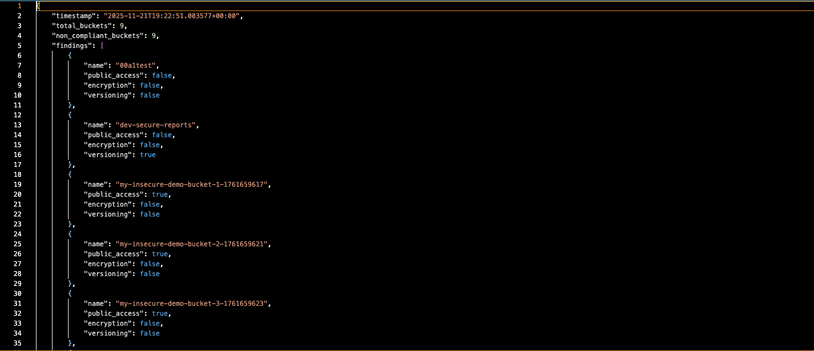
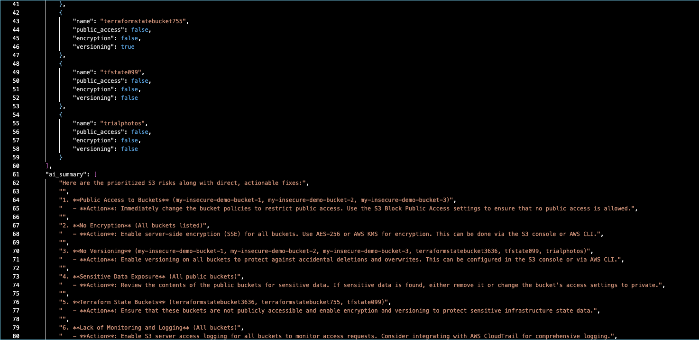

# Serverless-S3-Compliance-Scanner

# Project Description
This is a serverless S3 compliance scanner that audits encryption, public access, and versioning across all buckets and publishes versioned JSON reports to a secure S3 bucket. This project was
built based on a tutorial built with ChatGPT and Claude.ai.
# Architecture

# Components Description
| Component  | Functionality  |
|----------|----------|
| S3 Reports Bucket | The S3 bucket stores the JSON compliance reports generated by the Lambda scanner. |
| Lambda Function | The Lambda function runs the actual S3 compliance scanning logic. |
| AWS ECR | ECR acts as the secure container registry where your Lambda container image is stored. |
| CloudWatch | CloudWatch receives all logging output from the Lambda function. |
| Terraform | Terraform is used to automate and provision the entire cloud environment. |
| Docker | Docker packages the Python scanner application into a Lambda-compatible container image. |
| Trivy | An open-source security scanner that identifies vulnerabilities in container images and other artifacts. |
| AWS Secrets Manager | AWS Secrets Manager securely stores the OpenAI Project API key used by the Lambda function. Instead of hard-coding sensitive credentials. |
| OpenAI | Generate clear, human-readable summaries of S3 security findings and solutions. | 

# Prerequisites
* Install AWS cli
* Install VS Code
* Install Docker
* Install Trivy
* Install Colima (Only if using Mac OS)
## **Setting Permissions**
## Step 1: (**Testing Environment Only NOT Production**) Set these permissions for your Terraform user in AWS

| Terraform user | Environment  |
|----------|----------|
| **AdministratorAccess** | Test/Dev Only |
| **AmazonS3FullAccess** | Test/Dev Only |
| **AmazonEC2ContainerRegistryFullAccess** | Test/Dev Only |

## Step 2: **Set your AWS cli credentials**
```bash
aws configure
```


# Project Structure
```bash
s3_compliance_scan/
│
├── app/                     <- Lambda build directory
│   ├── main.py
│   ├── requirements.txt
│   └── Dockerfile           <- lambda container build
│
├── local_run/
│   ├── main.py              <- same code but built and able to run locally
│   ├── requirements.txt
│   └── Dockerfile
│
└── terraform/
    ├── main.tf
    ├── variables.tf
    ├── outputs.tf
    └── versions.tf
```
# Deployment Guide
## 1. **Create The Reports Bucket**
```bash
terraform init
```
```bash
terraform apply -target=aws_s3_bucket.reports_bucket
```
## 2. **Create ECR Repository**
```bash
terraform apply -target=aws_ecr_repository.scanner
```
## 3. **Build your Docker Image**
**Note:** Make sure you are in the root of the s3_compliance_scan folder before running the command below
```bash
docker build -t s3-scanner-lambda:lambda-arm64-fix2 -f app/Dockerfile .
```
## 4. **Scan your Docker Image for Vulnerabilities**
```bash
trivy image --severity HIGH,CRITICAL s3-scanner-lambda:lambda-arm64-fix2
```
**Results**

**Security Notes**

- This project uses the official AWS Lambda Python base image.

- Trivy reports several HIGH vulnerabilities in AWS-managed components (e.g., libcap).

- These libraries are built into the base image and cannot be patched by the application.

- All project-level dependencies are fully updated.

- The image will be rebuilt automatically when AWS releases patched base images.

## 5. **Push your Image to the ECR Repository**
**Authenticate your Docker Client**
```bash
aws ecr get-login-password --region us-east-1 | docker login --username AWS --password-stdin <aws account number>.dkr.ecr.us-east-1.amazonaws.com
```
**Tag the Image**
```bash
docker tag s3-scanner-lambda:<terraform image uri tag> <aws account number>.dkr.ecr.us-east-1.amazonaws.com/secure-s3-scanner-repo:<terraform image uri tag>
```
**Push the Image**
```bash
docker push 813429065442.dkr.ecr.us-east-1.amazonaws.com/secure-s3-scanner-repo:<terraform image uri tag>
```
## 6. **Create the Remaining Resource with Terraform**
**Note:** Make sure you are in the root of the s3_compliance_scan folder before running the command below.
```bash
terraform apply
```
## 7. **Trigger the Lambda Function**
```bash
aws lambda invoke --region us-east-1 --function-name secure-s3-scanner-fn --log-type Tail out.json > /dev/null
```
```bash
cat out.json | jq .
```


## 8. **Download S3 Compliance Report**


## 9. **Review Compliance Report**

In the report shown below the terms true and false are used to display what options are enabled and disabled **(enabled = true and disabled = false)**


## Viewed in VS Code


# Next Steps - Integrate OpenAI 

# Project Description
This part of the project integrates OpenAI with AWS Lambda to generate clear, human-readable summaries of S3 security findings and solutions. 

**A Few Things to Change**

Add the OpenAI dependency to the **app/requirements.txt** file
```bash
openai>=1.0.0
```
Add the following line of code to the top of the **main.py** file
```bash
from ai_helper import explain_findings
```
Add the following code section after the **non_compliant** code section
```bash
    ai_input = []
    for r in results:
        bucket_info = {
            "bucket": r["name"],
            "public": r["public_access"],
            "encryption": r["encryption"],
            "versioning": r["versioning"],
        }
        ai_input.append(bucket_info)
```
Add the following lines of code after **ai_input** section code
```bash
ai_notes = explain_findings(ai_input)
ai_summary_lines = ai_notes.split("\n")
```
Add the following line to the end of **payload** section code
```bash
'ai_summary': ai_summary_lines,
```
Once these changes are made, you will need to save everything and make the last remaining changes to our terraform code. 

**Terraform**
Add the following lines of code to your Terraform **lambda.tf**, under the **environment** section. 
```bash
AI_SECRET_NAME = "ai-api-key"
ENABLE_AI = "true"
```
# Final Project Structure
```bash
s3_compliance_scan/
├── app
│   ├── ai_helper.py
│   ├── Dockerfile
│   ├── main.py
│   └── requirements.txt
|
├── local_run
│   ├── Dockerfile
│   └── run.sh
|
├── README.md
├── terraform
│   ├── ecr.tf
│   ├── iam.tf
│   ├── lambda.tf
│   ├── outputs.tf
│   ├── provider.tf
│   ├── s3.tf
│   ├── terraform.tfvars
│   └── variables.tf
```

## 1. **Trigger the Lambda Function**

**Note:** Make sure you are in the root of the s3_compliance_scan folder before running the command below
```bash
aws lambda invoke --region us-east-1 --function-name secure-s3-scanner-fn --log-type Tail out.json > /dev/null
```
```bash
cat out.json | jq .
```
## 2. **View the Compliance AI Results**

